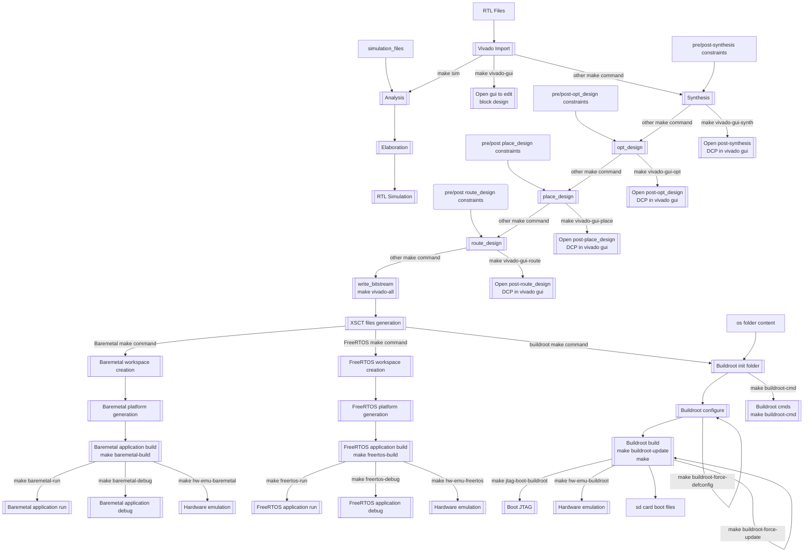

# Spectrum Analyzer


This project aims to develop a spectrum analyzer system using the Zynq-7000 board. The system will capture audio input (I2S), process it through a well-defined internal architecture, and output the data via DMA to a VGA screen. The VGA screen will display the signal as a frequency spectrum using FFT (Fast Fourier Transform).


## Buildroot framework for Zynq-7000
Requirements
----
- Modern Linux Distribution (Tested on Debian 10 buster)
- [Vivado 2022.2](https://www.xilinx.com/support/download/index.html/content/xilinx/en/downloadNav/vivado-design-tools/archive.html) with a valid license (Webpack succesfully tested)
- [Buildroot requirements](https://buildroot.org/downloads/manual/manual.html#requirement)
- Xilinx Simulator requirements: libncurses5 (`sudo apt install libncurses5-dev` on `Debian` and `Ubuntu`).
- Enough space on disk to store the output products (required:15GB, recommended:40GB)
- device-tree-compiler: `sudo apt install device-tree-compiler`

User files
----
- `rtl` contains directories which contains user ips rtl files and filelists, some of there are provided as example. See [RTL folder README](rtl/README.md) for more informations
- `os` contains buildroot packages and configs used
  - `configs` contains defconfigs for supported boards (here only zynq-zedboard is supported)
  - `board` contains scripts for post build or pre build
    - `<board name>` contains files specific to board supported (initially there is only `zynq-zedboard`)
  - `package` contains buildroot packages
- `mk` contains makefiles used internaly by the workflow. See [mk folder README](mk/README.md) for more informations
- `script` contains scripts used internally by the workflow. See [script folder README](script/README.md) for more informations
- `baremetal` contains baremetal projects
- `project` contains projects user files: mk file to list files to use for synthesis or simulation. See [project folder README](project/README.md) for more informations

Notations and vocabulary
----
- `<build_dir>` means `build/${PROJECT_NAME}_${BOARD_NAME}`
- `<project_mk_file>` means `project/${PROJECT_NAME}/${BOARD_NAME}.mk`
- `hardware emulation` means cosimulation with RTL simulator, systemc model and QEMU to be able to debug software and RTL design together.

Build steps and dependencies
----


Makefile parameters
----
- `PROJECT_NAME` : Name of the project to use (possible values: `spectrum_analyzer` or `sigma_delta`
- `BOARD_NAME` : Name of the board to use (possible values: `avnet-zedboard` or `xilinx-kria`
- `USE_PROBES` : Active or not debug cores generation. Must be `YES` or `NO` (default: `NO`)
- `RTL_LANGUAGE` : Preferred RTL language for generated files, must be `VHDL` or `Verilog` (default: `VHDL`)
- `SIM_MODE` : Simulation mode. Must be `gui` or `console` (default: `gui`)
- `SIM_TOP` : Simulation top level RTL module (default: project top level testbench)
- `BM_PROJECT` : Baremetal project name (no default value)
- `FREE_RTOS_PROJECT` : FreeRTOS project name (no default value)
- see [project README](project/README.md) for the project parameters
- see [rtl README](rtl/README.md) for more informations about how sources are imported

Before using this workflow:
----
Please see [initial configuration README](doc/before_using_this_flow.md)

Vivado and XSIM RTL simulation targets
----
See [Vivado and XSIM targets README](doc/vivado_targets.md)

Baremetal targets
----
See [baremetal targets README](doc/baremetal_targets.md)

Buildroot targets
----
See the [Buildroot targets README](doc/buildroot_targets.md)


Building all
----
```bash
make
```
Build bitstream, hardware definition file, FSBL, device-tree and buildroot distribution.

Cleaning all files
----
```bash
make clean
```
This will delete all generated files and output folders

Output files
----
See [generated outputs README](doc/output_files.md) for informations

LICENSE
----
This software is distributed with an Apache License 2.0 physically represented by the `LICENSE` file.

This implementations are based on the following authors base Workflow :

Copyright 2023 Raphaël Bresson, Maxime Lebreton
