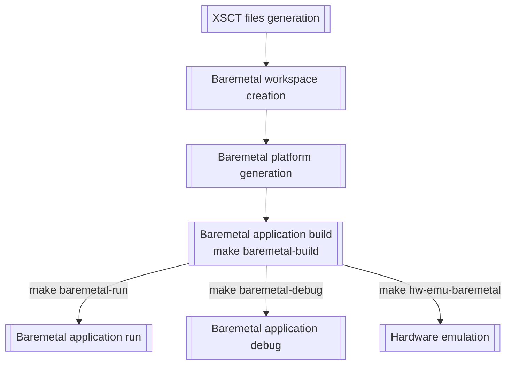

# Baremetal targets

Overview
----


Creating baremetal projects
----
Creating a baremetal project is done by adding a folder in the `baremetal` folder and adding source files:
```bash
mkdir -p baremetal/<your project name>
cp <path to project src directory>/* baremetal/<your project name>
```

Building a baremetal project:
----
```bash
make baremetal-build BM_PROJECT=<name of your project>
```

Opening minicom to display logs from uart serial interface
----
Ensure that the board serial interface (UART) is connected to your computer. Then open minicom (in a new terminal):
```bash
minicom -b 115200 -D /dev/ttyACM<N>
```
`<N>` is often 0 (check in your `/dev` folder).

Running project on board in non-interactive mode
----
```bash
make baremetal-run BM_PROJECT=<name of your project> # run app
```

Running project on board in interactive mode (debug mode)
----
```bash
make baremetal-debug BM_PROJECT=<name of your project> # run app
```
Refer to the following links to use interactive mode
- [XSCT runtime commands](https://www.xilinx.com/html_docs/xilinx2018_1/SDK_Doc/xsct/running/reference_xsct_running.html)
- [XSCT breakpoints commands](https://www.xilinx.com/html_docs/xilinx2018_1/SDK_Doc/xsct/breakpoints/reference_xsct_breakpoints.html)
- [XSCT memory commands](https://www.xilinx.com/html_docs/xilinx2018_1/SDK_Doc/xsct/memory/reference_xsct_memory.html)
- [XSCT register commands](https://www.xilinx.com/html_docs/xilinx2018_1/SDK_Doc/xsct/registers/reference_xsct_registers.html)

Executing Vitis in gui mode
----
Vitis
```bash
make vitis
```

Hardware emulation with baremetal application using XSIM and QEMU
----
```bash
make hw-emu-baremetal BM_PROJECT=<baremetal project> SIM_MODE=<gui|cli>
```
Launch hardware emulation.

Default value for `SIM_MODE`: `gui`

Cleaning baremetal workspace
----
```bash
make xsct-clean-workspace
```

Cleaning files generated by XSCT
----
```bash
make xsct-clean
```
