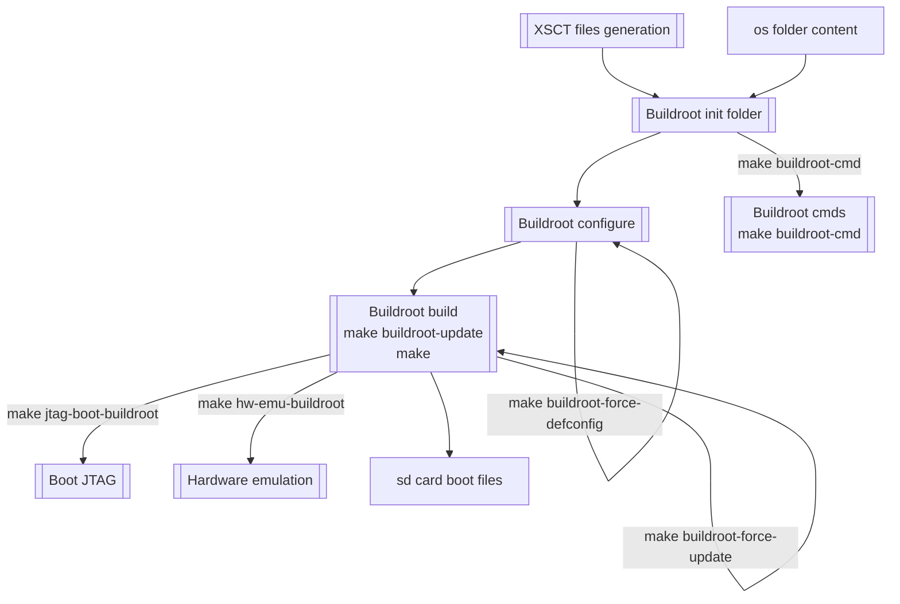

# Buildroot targets

Overview
----


Update buildroot:
----
```bash
make buildroot-update
```
This will (re)generate buildroot outputs
You can force this update with the following target:
```bash
make buildroot-force-update
```

Sending commands to buildroot
----
```bash
make buildroot-cmd CMD=<your command>
```
Send command to buildroot build system. CMD argument is mandatory.

Exemple: Open menuconfig of buildroot
```bash
make buildroot-cmd CMD="menuconfig"
```
  Exemple: Open menuconfig of the Linux Kernel
```bash
make buildroot-cmd CMD="linux-menuconfig"
```

Reconfiguring buildroot (if file `os/configs/zynq_zedboard_defconfig` is modified)
----
```bash
make buildroot-force-defconfig
```

Cleaning Buildroot output products
----
```bash
make buildroot-clean
```

Boot buildroot Linux from JTAG
----
Connect the board and run the following command:
```bash
make xcst-boot-jtag-buildroot
```
Run Minicom in another terminal to see the logs from the uart serial interface:
```bash
minicom -b 115200 -D /dev/ttyACM<number>
```

Hardware emulation with GNU/Linux Buildroot distribution using XSIM and QEMU
----
```bash
make hw-emu-buildroot SIM_MODE=<gui|cli>
```
Launch hardware emulation.

Default value for `SIM_MODE`: `gui`

Like for baremetal applications, a TCP socket is created for GDB or XSCT.

This feature is fully functionnal for Zynq-7000 devices but broken for ZynqMP devices: Work in progress

Boot Linux from SDCARD
----
Insert SDCARD and run the following command:
```bash
sudo fdisk -l
```
Using the output of the previous command you should be able to identify the file in /dev that corresponds to your SDCARD.
It can be `/dev/mmcblk<number>` or `/dev/sd<letter>`.

Two partitions are required:
- \"BOOT\" formated in fat32 and containing boot files
- \"ROOTFS\" formated in ext4 and containing the root filesystem

  This can be done as following:

  First umount device and erase its first bytes (location of partition table)
```bash
sudo umount /dev/<device>*
sudo dd if=/dev/null of=/dev/<device> bs=1024 count=1
```
  Then use fdisk or other tool to design disk partitions. See [fdisk documentation](https://www.man7.org/linux/man-pages/man8/fdisk.8.html) to know how to use fdisk

  Then format your partitions:
```bash
sudo mkfs.vfat -n BOOT   /dev/<device><part1>
sudo mkfs.ext4 -L ROOTFS /dev/<device><part2>
```
  Then mount partitions and copy files
```bash
sudo mount /dev/<device><part1> <part1 mount point>
sudo mount /dev/<device><part2> <part2 mount point>
cp build/buildroot-output/images/boot/* <part1 mount point>
sudo tar xf build/buildroot-output/images/rootfs.tar -C <part2 mount point>
```
  After all, unmount partitions
```bash
sudo umount /dev/<device>*
```
  Then run Minicom and insert SDCARD.
