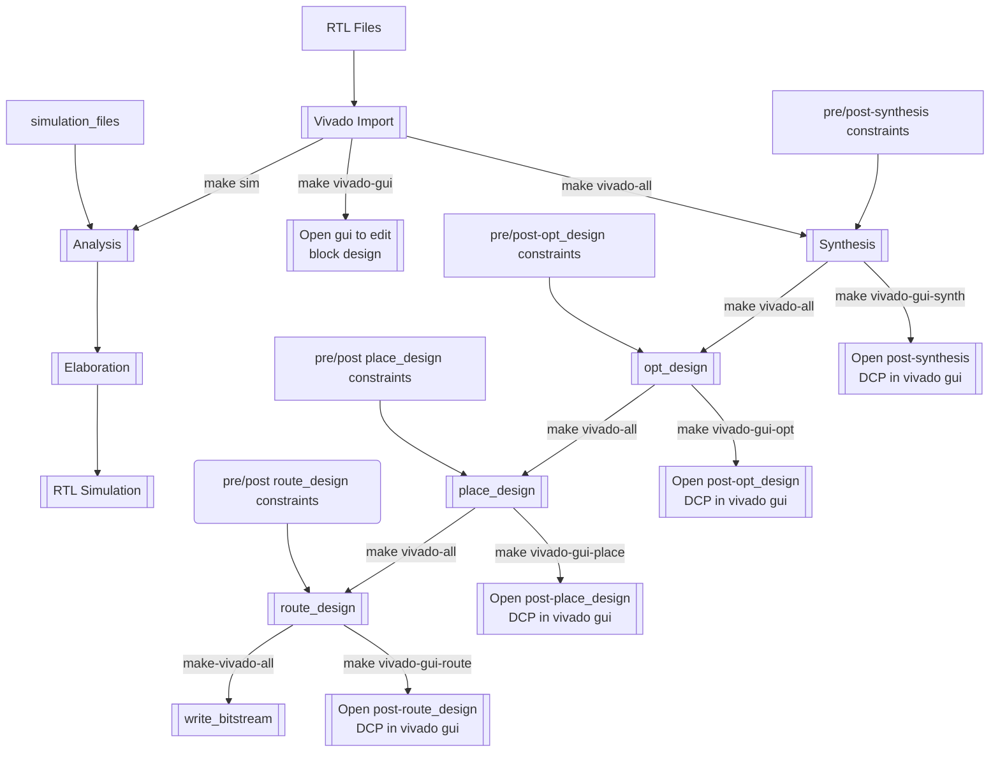

# Vivado and XSIM TARGETS

Overview
----


Generating bitstream
----
```bash
make vivado-all
```
This will generate bitstream (.bit) and hardware platform (.xsa) files.

Execute Vivado in GUI mode
----
```bash
make vivado-gui
```

Open synthetized design in GUI
----
```bash
make vivado-gui-synth
```

Open optimized design in GUI (first step of implementation)
----
```bash
make vivado-gui-opt
```

Open placed design in GUI (second step of implementation)
----
```bash
make vivado-gui-placement
```

Open routed design in GUI (final step of implementation)
----
```bash
make vivado-gui-route
```

Cleaning Vivado output products
----
```bash
make vivado-clean
```

Adding debug probes
----
First open synthetized design
```bash
make vivado-gui-synth
```
Then select the signal you want to debug. Do right click on it and select `Mark Debug`.

Repeat this operations for each signal to debug.

In the menubar, click on `Tools` then `Set Up Debug` and follow the instructions in the dialog window.

In tcl console, get all tcl commands (in blue) to generate the ILA cores. Then copy them in an xdc file in project folder and add it to the `PROBE_CONSTRAINTS` is the project mk file.
```Makefile
  PROBE_CONSTRAINTS += <path to xdc file>
```

Then you can close the vivado window.

Then regenerate bitstream with the argument `USE_PROBES=YES` and program the board (using baremetal or buildroot flow).

Then open vivado gui.
```bash
vivado &
```
Then click on `Open Hardware Manager` then `Open Target` and select `Auto Connect`. The waveforms of ILA are opening.

Click on `Specify the probes and refresh the device` and select the file `<build_dir>/vivado/probes.ltx`.

Behavioral simulation using XSIM (Xilinx Simulator):
----
```bash
make sim SIM_TOP=<simulation_top_entity> SIM_MODE=<gui|cli>
```
Launch behavioral simulation.

Default value for `SIM_TOP`: defined in project (top level testbench)

Default value for `SIM_MODE`: `gui`

Cleaning simulation files
----
```bash
make sim-clean
```
This will delete all files generated by XSIM

