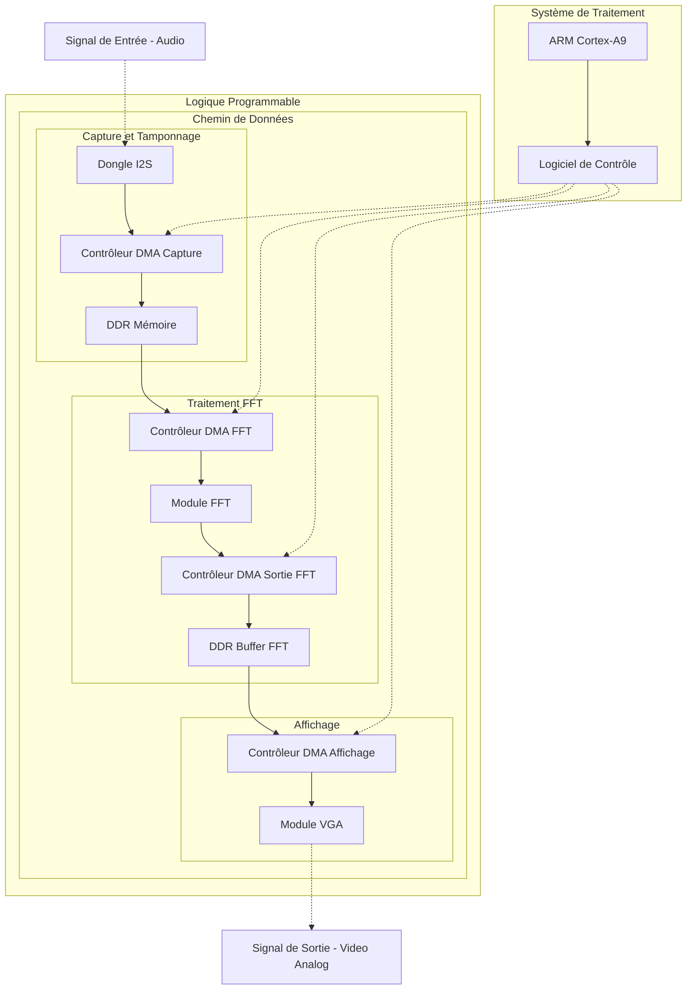
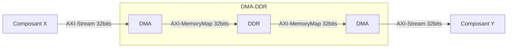

# Project

Description
----
This folder is dedicated to project and board specific files (top rtl design, main filelist, constraints, top simulation testbench). It is organized in 2 level of subfolders.
On the first level, there is one subfolder per project.
On the second level there is one subfolder per supported board. There is also one makefile source (.mk) which define:
- Internal parameters of the project according to the targetted board
- IP in `rtl` folder to be used
- Top module design
- Importation of board/project specific files (RTL sources, constraints)


Organization
----
- `<project0_name>/`
	- `<board0_name>.mk`
	- `<board1_name>.mk`
	- `<board0_name>/`
		- `constrs/`
		- `sim/`
		- `synth/`
	- `<board1_name>/`
		- `constrs/`
		- `sim/`
		- `synth/`
- `<project1_name>/`
	- `<board0_name>.mk`
	- `<board1_name>.mk`
	- `<board0_name>/`
		- `constrs/`
		- `sim/`
		- `synth/`
	- `<board1_name>/`
		- `constrs/`
		- `sim/`
		- `synth/`

Project parameters
----
- `TOP` : Top level of the RTL design (must be synthetizable)
- `PRE_SYNTH_CONSTRAINTS` : Constraints files to be used before `synthesis` step
- `POST_SYNTH_CONSTRAINTS` : Constraints files to be used after `synthesis` step
- `PRE_OPT_CONSTRAINTS` : Constraints files to be used before `opt_design` step
- `POST_OPT_CONSTRAINTS` : Constraints files to be used after `opt_design` step
- `PRE_PLACEMENT_CONSTRAINTS` : Constraints files to be used before `placement` step
- `POST_PLACEMENT_CONSTRAINTS` : Constraints files to be used after `placement` step
- `PRE_ROUTE_CONSTRAINTS` : Constraints files to be used before `route` step
- `POST_ROUTE_CONSTRAINTS` : Constraints files to be used after `placement` step
- `PRE_BITSTREAM_CONSTRAINTS` : Constraints files to be used before `bitstream generation` step
- `PROBES_CONSTRAINTS` : Constrained files to be use before `opt_design` step to generate debug probes
- `SYNTH_SRC`: Synthetizable RTL files
- `SIM_SRC`: RTL files used for simulation only

Importing and IP
----

```make
include rtl/<ip_name>/sources.mk
```

# Architecture




